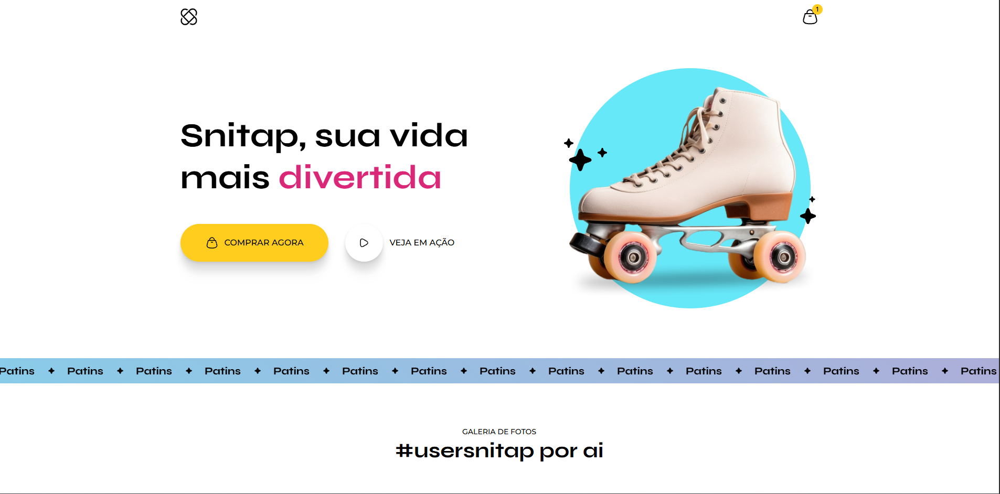

# 🛼 Landing Page de Patins Animada - Rocketseat Challenge

Este projeto foi desenvolvido como parte de um desafio do curso Fullstack da Rocketseat.  
O objetivo era criar uma landing page com visual moderno e elementos animados, aplicando conceitos de HTML, CSS e transições visuais para uma experiência mais interativa.

## 📚 Descrição do projeto

A página apresenta:

- Layout centralizado com imagem de destaque
- Textos de chamada com animações suaves
- Botão com efeitos visuais ao passar o mouse
- Design focado em produto, inspirado em uma loja de patins

## 💻 Tecnologias utilizadas

- HTML5  
- CSS3  
- Animações com `@keyframes`, `transition` e `transform`  
- Responsividade básica com media queries

## 🌐 Acesse o projeto online

🔗 [Clique aqui para visualizar](https://kauasilvandrade.github.io/lp-patins-animado/)

## 📸 Imagem do projeto

## 📌 Status do projeto

✅ Projeto finalizado e publicado.

## ✍️ Autor

**Kauã da Silva Andrade**  
[LinkedIn](https://www.linkedin.com/in/kauã-andrade-6440a9225)  
[GitHub](https://github.com/kauasilvandrade)
